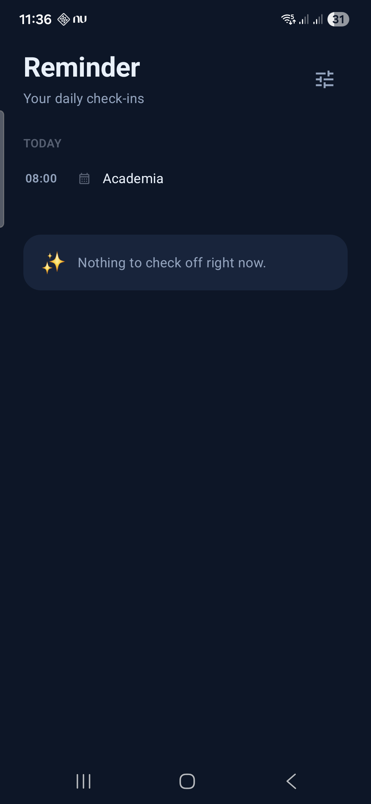
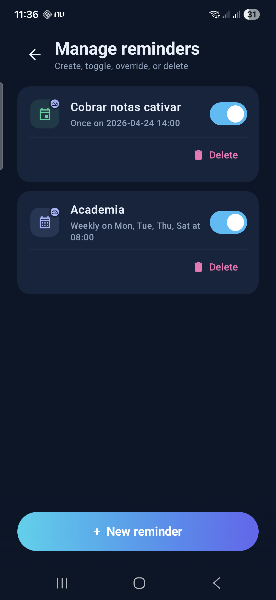

# Reminder

Local-first reminder app with cloud sync.

- **android/** — Kotlin / Jetpack Compose client. Room is the source of truth; a `SyncManager` pushes queued changes and pulls the latest state whenever the network is available.
- **backend/Reminder.Api/** — ASP.NET Core (.NET 10) minimal API. EF Core + PostgreSQL. No auth (single-user app for now).
- **db/** — seed scripts / migrations live here.
- **docker-compose.yml** — runs Postgres + API.

## Screenshots

| Home | Manage |
| --- | --- |
|  |  |

## Reminder model

- **Description** — free text.
- **ScheduleKind**:
  - `Daily` — fire every day at a given local HH:MM.
  - `Weekly` — fire at HH:MM on every selected day of the week (e.g. Mon, Wed, Fri).
  - `OneTime` — fire at a specific UTC moment.
- **Occurrences** — each time a reminder fires, we record an occurrence. The UI shows unchecked occurrences as a checklist. While an occurrence is unchecked, Android re-rings it every hour. Check-offs play a confetti animation and land in a green "Done today" section.

## Running the backend

```bash
cp .env.example .env          # adjust values
docker compose up -d          # postgres on :5433, api on :8081
```

For local dev without Docker:

```bash
cd backend/Reminder.Api
dotnet user-secrets set "ConnectionStrings:Postgres" "Host=localhost;Port=5433;Database=reminder;Username=reminder;Password=change_me"
dotnet run     # http://0.0.0.0:5080
```

## Running the Android app

1. `cp android/local.properties.example android/local.properties` and set `sdk.dir` + `reminder.api.baseUrl`.
    - Emulator → `http://10.0.2.2:5080/`
    - Physical device → `http://<your-LAN-IP>:5080/`
2. Open `android/` in Android Studio and Run.

## Offline behavior

- Creating, editing, deleting reminders and checking off occurrences works fully offline — each write hits Room immediately and flags the row `pendingCreate` / `pendingUpdate` / `pendingDelete` / `pendingCheck`.
- When connectivity is reported, `SyncManager` pushes each queued change and pulls the server's current state. Conflicts resolve local-wins if the row still has pending flags, server-wins otherwise.
- Alarms fire via `AlarmManager` regardless of network state. The hourly re-ring is also a local alarm, so un-checked reminders keep nagging you offline.
